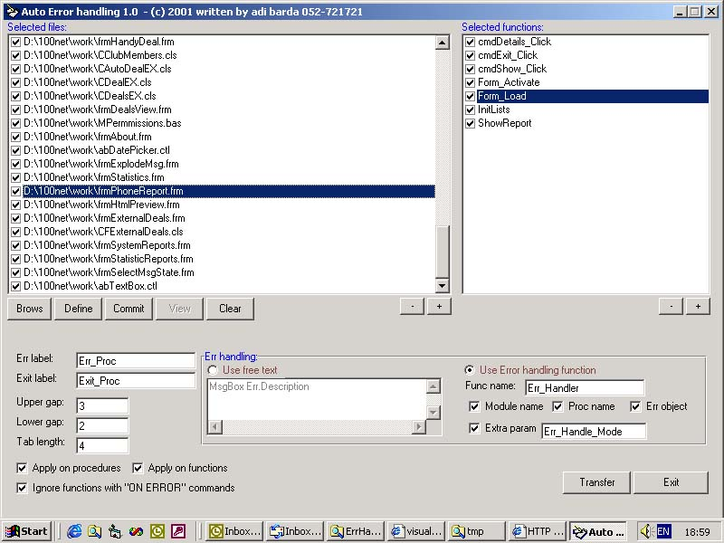



## Automatic error handling tool

### Description

Automatic Err handling tool:

New features:

1. Show module interface - show smart description of all your app modules without the code - just the description and comments very usefull for designing && debuging

2. Ignore functions starting with - you choose wich functions will be ignored when error handling code is inserted by typing thier first letters for example "cmd,chk" - all the functions wich starts with those letters will not have error handling code.

3. Printing - now printing your code && your interface is allowed

thats it - wait for new updates

This is the ultimate tool for adding error handling code in your apps with absolutly no effort at all and with great flexibility. simply brows for the vb project file (vbp), select for wich file and functions you want to add the error handling code ( the default is for all the files and functions ) and let the utility do the rest. use the following steps:

1. BROWS - select a vb project ( you can add more than one project )

2. Press the DEFINE button ( now the utility recognize all the functions in the project )

3. optional - select wich files to add error handling and wich functions in every file

4. Press COMMIT to generate the new files ( with error handling in every function )

5. optional - Press VIEW to compare the original files to the new one ( with the added code )

6. optional - Press TRANSFER to replace the original files with the new ones

NOTE: there are lots more options in the utility - check it out

I use this application with all my projects and it realy saves lots of time and generates very smart error handling code.

Take it, use it, enjoy it and tell me if you like it or any other comment. have a nice work.
 
### More Info
 

             |
---                |---
**Submitted On**   |2001-07-17 11:56:36
**By**             |[ADI BARDA](https://github.com/Planet-Source-Code/PSCIndex/blob/master/ByAuthor/adi-barda.md)
**Level**          |Advanced
**User Rating**    |4.7 (93 globes from 20 users)
**Compatibility**  |VB 5\.0, VB 6\.0
**Category**       |[Debugging and Error Handling](https://github.com/Planet-Source-Code/PSCIndex/blob/master/ByCategory/debugging-and-error-handling__1-26.md)
**World**          |[Visual Basic](https://github.com/Planet-Source-Code/PSCIndex/blob/master/ByWorld/visual-basic.md)
**Archive File**   |[Automatic 229347172001\.zip](https://github.com/Planet-Source-Code/adi-barda-automatic-error-handling-tool__1-21507/archive/master.zip)

